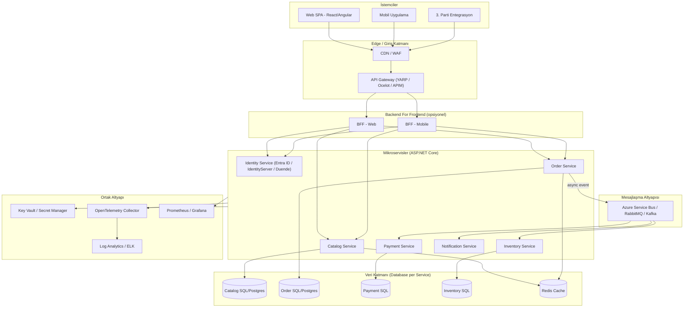
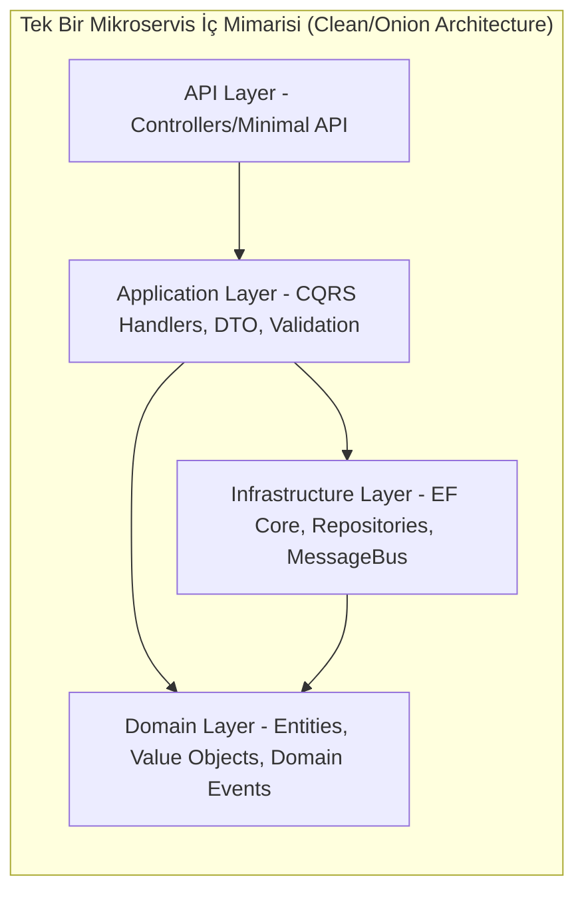
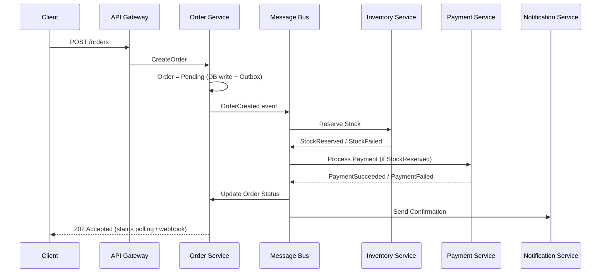
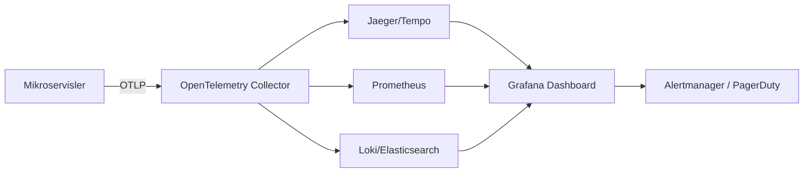
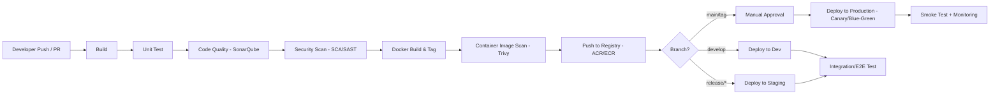
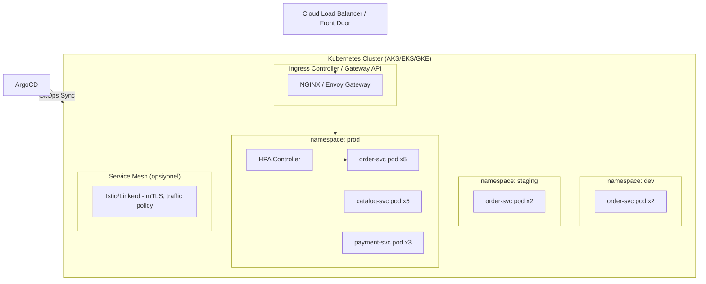
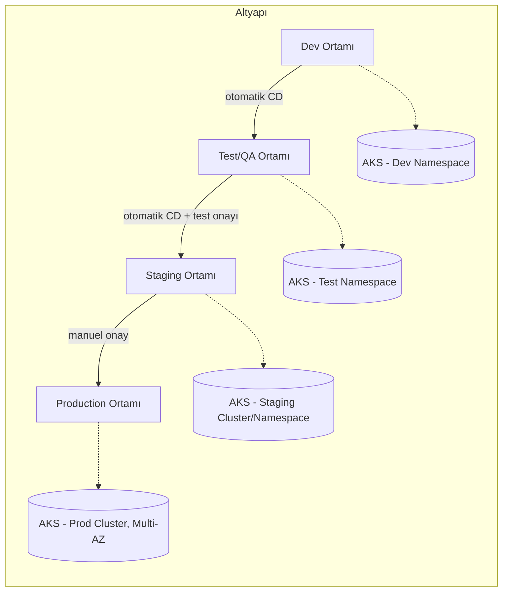

# .NET Mikroservis Mimarisi — Uçtan Uca Tasarım Dokümanı

Bu doküman, .NET (ASP.NET Core / .NET 8+) tabanlı bir mikroservis uygulamasının
mimari tasarımından, kullanılması gereken teknoloji yığınına, CI/CD DevOps
süreçlerine ve sunuculara (Kubernetes) konumlandırılmasına kadar uçtan uca
tüm süreci kapsar.

## İçindekiler
1. [Genel Mimari](#1-genel-mimari)
2. [Servis Envanteri](#2-servis-envanteri)
3. [Teknoloji Yığını](#3-teknoloji-yığını)
4. [Tasarım Prensipleri ve Desenler](#4-tasarım-prensipleri-ve-desenler)
5. [Servisler Arası İletişim](#5-servisler-arası-i̇letişim)
6. [Veri Yönetimi Stratejisi](#6-veri-yönetimi-stratejisi)
7. [Güvenlik Mimarisi](#7-güvenlik-mimarisi)
8. [Gözlemlenebilirlik (Observability)](#8-gözlemlenebilirlik-observability)
9. [CI/CD ve DevOps Süreci](#9-cicd-ve-devops-süreci)
10. [Konteynerleştirme ve Kubernetes Konumlandırma](#10-konteynerleştirme-ve-kubernetes-konumlandırma)
11. [Ortam Topolojisi (Dev/Test/Staging/Prod)](#11-ortam-topolojisi-devteststagingprod)
12. [Repo / Klasör Yapısı Önerisi](#12-repo--klasör-yapısı-önerisi)
13. [Örnek Dosyalar](#13-örnek-dosyalar)

---

## 1. Genel Mimari



**Temel prensipler:**
- Her mikroservis kendi veritabanına sahiptir (**Database per Service**).
- Servisler arası senkron iletişim REST/gRPC, asenkron iletişim ise mesaj kuyruğu/event bus üzerinden yapılır.
- API Gateway; kimlik doğrulama, rate limiting, routing ve SSL sonlandırma gibi kesişen sorumlulukları üstlenir.
- Tüm servisler stateless tasarlanır, durum bilgisi Redis/DB gibi harici depolarda tutulur (yatay ölçeklenebilirlik için).

---

## 2. Servis Envanteri

| Servis | Sorumluluk | Veritabanı | İletişim |
|---|---|---|---|
| Identity Service | Kimlik doğrulama, token üretimi (OAuth2/OIDC) | SQL Server | REST |
| Catalog Service | Ürün/kategori yönetimi | PostgreSQL + Redis (cache) | REST/gRPC |
| Order Service | Sipariş oluşturma, saga orkestrasyonu | SQL Server | REST + Event |
| Payment Service | Ödeme işlemleri, 3. parti ödeme sağlayıcı entegrasyonu | SQL Server | Event-driven |
| Inventory Service | Stok takibi ve rezervasyon | PostgreSQL | Event-driven |
| Notification Service | E-posta/SMS/Push bildirimleri | MongoDB / Table Storage | Event-driven |
| API Gateway | Routing, auth, rate limit, agregasyon | — | HTTP |

---

## 3. Teknoloji Yığını

| Katman | Teknoloji |
|---|---|
| Dil / Framework | .NET 8/9 LTS, ASP.NET Core Web API, Minimal API |
| API Gateway | YARP (Reverse Proxy) veya Azure API Management / Ocelot |
| Servisler arası senkron iletişim | REST (HttpClient + Refit/Polly), gRPC |
| Asenkron mesajlaşma | Azure Service Bus, RabbitMQ (MassTransit), Apache Kafka |
| Veritabanı | SQL Server, PostgreSQL, MongoDB (servise göre polyglot persistence) |
| ORM | Entity Framework Core, Dapper (yüksek performans senaryoları) |
| Cache | Redis (Distributed Cache, IDistributedCache) |
| Kimlik & Erişim | Microsoft Entra ID, Duende IdentityServer, JWT Bearer, OAuth2/OIDC |
| API Dokümantasyonu | Swagger / OpenAPI (Swashbuckle), Scalar |
| Loglama | Serilog + Sinks (Seq, Elasticsearch, Application Insights) |
| Metrikler | OpenTelemetry Metrics + Prometheus + Grafana |
| Dağıtık İzleme (Tracing) | OpenTelemetry Tracing + Jaeger / Zipkin / Azure Monitor |
| Resilience | Polly (retry, circuit breaker, timeout) |
| Validasyon | FluentValidation |
| Mapping | Mapster / AutoMapper |
| Test | xUnit/NUnit, FluentAssertions, Testcontainers, WireMock.NET |
| Konteyner | Docker, Docker Compose (yerel geliştirme) |
| Orkestrasyon | Kubernetes (AKS / EKS / GKE / on-prem) |
| Paketleme | Helm Charts / Kustomize |
| GitOps | ArgoCD / Flux |
| CI/CD | Azure DevOps Pipelines, GitHub Actions, GitLab CI |
| IaC | Terraform / Bicep |
| Secret Yönetimi | Azure Key Vault, HashiCorp Vault, Kubernetes Secrets + External Secrets Operator |
| API Ağ Geçidi Güvenliği | WAF, Azure Front Door / Cloudflare |
| Servis Keşfi | Kubernetes DNS (Service), Consul (opsiyonel) |

---

## 4. Tasarım Prensipleri ve Desenler

- **Domain-Driven Design (DDD):** Her mikroservis bir *Bounded Context*'i temsil eder; Katmanlar: `Domain`, `Application`, `Infrastructure`, `API`.
- **CQRS (Command Query Responsibility Segregation):** Yazma ve okuma modellerinin ayrılması (MediatR ile komut/sorgu ayrımı).
- **Saga Pattern:** Dağıtık transaction yönetimi için orkestrasyon (Order Service) veya koreografi (event-driven) tabanlı saga.
- **Outbox Pattern:** Veritabanı işlemi ile event yayınlamanın atomik garanti altına alınması (transactional outbox + polling/CDC).
- **Circuit Breaker / Retry / Timeout:** Polly ile dayanıklılık (resilience) sağlanması.
- **API Gateway / BFF Pattern:** İstemciye özel agregasyon ve kesişen kaygıların merkezi yönetimi.
- **Sidecar Pattern:** Service mesh (Istio/Linkerd) kullanılıyorsa mTLS, gözlemlenebilirlik, trafik yönetimi.
- **Health Check Pattern:** `/health/live`, `/health/ready` uç noktaları (ASP.NET Core Health Checks) — Kubernetes liveness/readiness probe entegrasyonu.
- **Strangler Fig Pattern:** Monolitik sistemden mikroservise kademeli geçiş için.
- **Idempotency:** Event/komut işleme sırasında tekrar işlemeyi önlemek için idempotency key kullanımı.



---

## 5. Servisler Arası İletişim

| Senaryo | Yöntem | Örnek |
|---|---|---|
| Anlık sorgu-cevap gereken durum | Senkron REST / gRPC | Order Service → Catalog Service (ürün fiyatı sorgulama) |
| İş akışı / durum değişikliği bildirimi | Asenkron Event (pub/sub) | Order Created → Inventory, Payment, Notification |
| Yüksek performans, güçlü tipli iç servis çağrısı | gRPC | Catalog ↔ Inventory |
| Harici / 3. parti sistem entegrasyonu | REST / Webhook | Payment Gateway callback |

**Event-driven akış örneği (Sipariş Saga):**



---

## 6. Veri Yönetimi Stratejisi

- **Database per Service:** Servisler doğrudan başka servisin veritabanına erişemez.
- **Polyglot Persistence:** İhtiyaca göre ilişkisel (SQL Server/PostgreSQL), doküman (MongoDB) veya key-value (Redis) veritabanları.
- **Eventual Consistency:** Servisler arası veri tutarlılığı event'ler aracılığıyla, senkron değil.
- **CDC / Outbox:** Debezium veya EF Core tabanlı outbox polling ile güvenilir event yayını.
- **Migration Yönetimi:** EF Core Migrations, her servisin kendi migration pipeline'ı (CI/CD'de otomatik `dotnet ef database update`).
- **Read Model / Materialized View:** CQRS'te sorgu tarafında performans için ayrı, denormalize okuma modelleri.

---

## 7. Güvenlik Mimarisi

- **AuthN/AuthZ:** OAuth2 / OpenID Connect, Microsoft Entra ID veya Duende IdentityServer, JWT Bearer token.
- **API Gateway seviyesinde:** Token doğrulama, rate limiting, IP whitelisting, WAF.
- **Servisler arası (east-west) trafik:** mTLS (service mesh) veya mesh yoksa client-credentials flow ile servis-servis token.
- **Secrets:** Uygulama kodunda secret barındırılmaz; Azure Key Vault / HashiCorp Vault + Kubernetes CSI Secret Store driver veya External Secrets Operator.
- **Least Privilege:** Her servisin Managed Identity / Service Account'u sadece ihtiyaç duyduğu kaynaklara erişebilir (RBAC).
- **Input Validation:** FluentValidation + model binding güvenliği (aşırı veri gönderimi/mass assignment önleme).
- **OWASP Top 10 kontrolleri:** SQL Injection (parametrized query/EF Core), XSS (output encoding), CSRF (SameSite cookie/antiforgery), güvenli HTTP başlıkları (HSTS, CSP).
- **Container güvenliği:** Distroless/minimal base image, non-root user, imaj tarama (Trivy/Defender for Containers), imza doğrulama (Notation/Cosign).
- **Network Policy:** Kubernetes NetworkPolicy ile namespace/pod bazlı trafik izolasyonu.

---

## 8. Gözlemlenebilirlik (Observability)

| Sinyal | Araç |
|---|---|
| Loglar | Serilog → stdout → Fluent Bit/Fluentd → Elasticsearch/Log Analytics |
| Metrikler | OpenTelemetry Metrics → Prometheus → Grafana Dashboard |
| Dağıtık İzleme | OpenTelemetry Tracing → Jaeger/Zipkin/Azure Monitor Application Insights |
| Sağlık Kontrolleri | `/health/live`, `/health/ready` (AspNetCore.HealthChecks) |
| Alarm/Alerting | Grafana Alerting, Azure Monitor Alerts, PagerDuty entegrasyonu |
| Correlation | `TraceId`/`CorrelationId` tüm servislerde HTTP header (`traceparent`) ile taşınır |



---

## 9. CI/CD ve DevOps Süreci

### 9.1 Pipeline Aşamaları



### 9.2 Aşama Detayları

1. **Build:** `dotnet restore` → `dotnet build -c Release`.
2. **Unit Test:** `dotnet test` + kod kapsama (Coverlet), sonuçlar pipeline'a rapor edilir.
3. **Statik Kod Analizi:** SonarQube/SonarCloud ile kod kalitesi kapı (quality gate) kontrolü.
4. **Güvenlik Taraması:**
   - **SCA (Software Composition Analysis):** `dotnet list package --vulnerable`, Dependabot/Snyk.
   - **SAST:** SonarQube security rules, Roslyn analyzers.
5. **Docker Image Build:** Multi-stage Dockerfile (SDK image → build → runtime image, non-root user).
6. **Image Scan:** Trivy/Grype ile CVE taraması; kritik zafiyet varsa pipeline durdurulur.
7. **Registry Push:** Azure Container Registry / Amazon ECR / Docker Hub (private), imaj etiketleme (`gitSha`, `semver`).
8. **Deployment:**
   - Dev/Staging: otomatik (continuous deployment), Helm/Kustomize ile `kubectl apply` veya ArgoCD sync.
   - Production: manuel onay adımı + **Blue-Green** veya **Canary** dağıtım stratejisi.
9. **Post-Deploy:** Smoke test, health check doğrulama, otomatik rollback (deployment health metriklerine göre).

### 9.3 Branching Stratejisi
- **Trunk-based / GitFlow** (ekip büyüklüğüne göre): `main` (prod), `develop` (entegrasyon), `feature/*`, `release/*`, `hotfix/*`.
- Her PR için zorunlu: build + test + code review (min. 1-2 reviewer) + branch protection rules.

### 9.4 GitOps Yaklaşımı
- Uygulama kodu ve altyapı (Helm values/Kustomize overlay) **ayrı repo**larda tutulur.
- CI, imajı build edip registry'ye pushlar ve **infra repo**daki image tag'ini günceller (PR açar).
- ArgoCD/Flux, infra repo'daki değişikliği algılayıp cluster'a otomatik senkronize eder (deklaratif, denetlenebilir deployment).

---

## 10. Konteynerleştirme ve Kubernetes Konumlandırma

### 10.1 Dockerfile Prensipleri
- Multi-stage build (SDK → publish → `aspnet` runtime image).
- Non-root kullanıcı (`USER app`), minimal base image (`mcr.microsoft.com/dotnet/aspnet:8.0-alpine`).
- `HEALTHCHECK` tanımı ve `.dockerignore` ile gereksiz dosyaların imaja girmemesi.

### 10.2 Kubernetes Nesneleri (servis başına)
- `Deployment` (replica, resource limits/requests, liveness/readiness probe)
- `Service` (ClusterIP, servis keşfi)
- `Ingress` / `Gateway API` (dış erişim, TLS termination)
- `ConfigMap` / `Secret` (yapılandırma ve gizli veriler)
- `HorizontalPodAutoscaler` (CPU/Mem veya custom metric bazlı otomatik ölçekleme)
- `PodDisruptionBudget` (kesintisiz güncelleme için minimum kullanılabilirlik)
- `NetworkPolicy` (izole trafik kuralları)

### 10.3 Cluster Topolojisi



### 10.4 Dağıtım Stratejileri
| Strateji | Kullanım Senaryosu |
|---|---|
| Rolling Update | Varsayılan, kesintisiz güncelleme |
| Blue-Green | Ani/riskli production geçişleri, hızlı rollback ihtiyacı |
| Canary | Yeni sürümün küçük trafik yüzdesiyle test edilmesi (Flagger/Argo Rollouts) |
| Feature Flags | Kod dağıtımı ile özellik aktivasyonunun ayrıştırılması |

---

## 11. Ortam Topolojisi (Dev/Test/Staging/Prod)



- **Dev:** Tek replika, düşük kaynak limiti, geliştirici sık deploy eder.
- **Test/QA:** Otomatik entegrasyon/E2E test paketleri burada çalışır.
- **Staging:** Production ile birebir aynı konfigürasyon (veri hariç), performans/yük testleri.
- **Production:** Multi-AZ/Multi-node, otomatik ölçekleme, sıkı RBAC, değişiklik onay süreci (Change Management).

---

## 12. Repo / Klasör Yapısı Önerisi

```
src/
  services/
    Order/
      Order.Api/
      Order.Application/
      Order.Domain/
      Order.Infrastructure/
      Order.Tests/
    Catalog/
    Payment/
    Inventory/
    Notification/
  gateway/
    ApiGateway/
  shared/
    BuildingBlocks.EventBus/
    BuildingBlocks.Common/
deploy/
  helm/
    order-service/
    catalog-service/
  k8s-base/
  overlays/
    dev/
    staging/
    prod/
pipelines/
  azure-pipelines.yml
  github-actions/
docker-compose.yml
```

---

## 13. Örnek Dosyalar

Bu depoda örnek olması için aşağıdaki dosyalar eklenmiştir:
- [dotnet-microservices/k8s/order-service-deployment.yaml](dotnet-microservices/k8s/order-service-deployment.yaml) — Örnek .NET mikroservis Kubernetes `Deployment`, `Service`, `HPA` tanımı.
- [dotnet-microservices/ci-cd/azure-pipelines.yml](dotnet-microservices/ci-cd/azure-pipelines.yml) — Örnek Azure DevOps CI/CD pipeline.
- [dotnet-microservices/ci-cd/github-actions.yml](dotnet-microservices/ci-cd/github-actions.yml) — Örnek GitHub Actions workflow.
